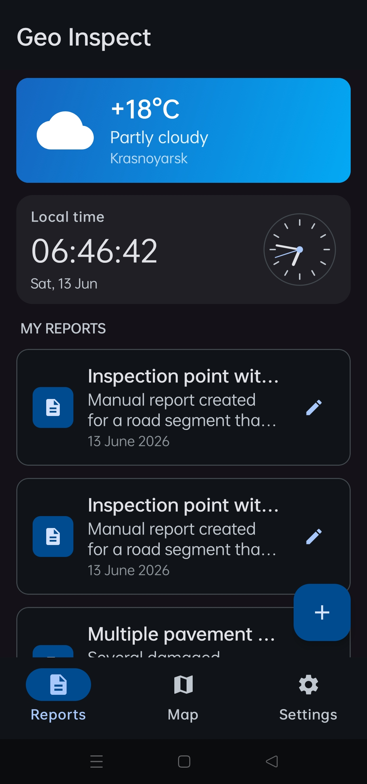
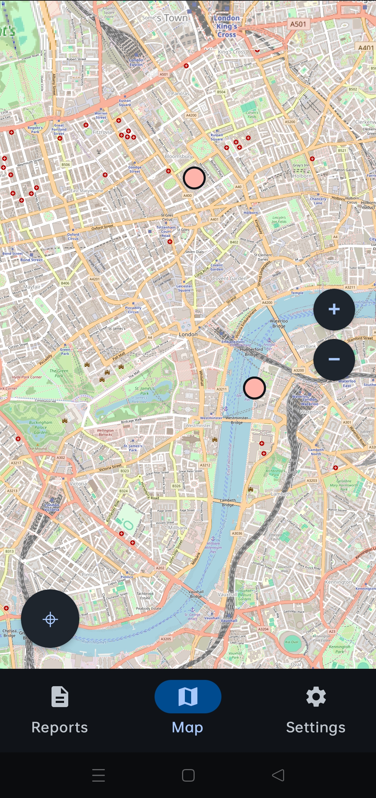
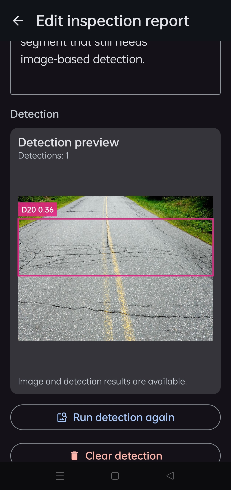

<h1 align="center">
  <br>
  
  <br>
  <b>GeoInspect</b>
  <br>
</h1>

<p align="center">
  Mobile inspection reports, geolocation, weather context and infrastructure damage detection.
</p>

<p align="center">
  
  
  
  
  
  
</p>

---

## Overview

**GeoInspect** is a client-server system for creating, managing and exporting geotagged infrastructure inspection reports.

The Android app allows users to create inspection reports linked to map coordinates, attach detection results, view local weather context, export/import report archives and run infrastructure damage detection on images.

The project consists of three main parts:

* **MobileApp** — Android client built with Kotlin and Jetpack Compose.
* **Server** — Spring Boot backend with Firebase authentication, image validation and profile/report-related APIs.
* **DetectionTrainProj** — YOLO training workspace with datasets, training runs, tools and model artifacts.

---

## Features

### Android app

* Create and edit geotagged inspection reports.

* View reports on a map.

* Store report location, title, content and detection metadata.

* Run image-based infrastructure damage detection.

* Take photos with the camera or choose images from gallery.

* Crop images before detection.

* View detection boxes over images.

* Export and import reports as a folder archive:
  
  * JSON report payload,
  * `reports/` image directory.

* Firebase authentication:
  
  * email and password,
  * Google sign-in,
  * guest access.

* Profile management:
  
  * username changes,
  * password changes,
  * custom avatar upload and reset.

* Settings screen:
  
  * theme mode,
  * backend API base URL,
  * server availability checks,
  * data import/export,
  * reset to default reports.

* Local map cache stored separately from temporary image cache.

* Adaptive UI for portrait, landscape and wider layouts.

### Backend

* Spring Boot REST API.

* Firebase ID token authentication.

* User profile avatar endpoints.

* Image upload validation:
  
  * MIME type handling,
  * magic bytes verification,
  * optional ClamAV validation.

* YOLO inference integration through a Python component.

* Rate limiting and centralized error handling.

### Machine learning

* YOLO-based infrastructure damage detection.
* Separate training workspace in `DetectionTrainProj`.
* Python inference runtime under `Server/python-yolo`.

---

## Table of Contents

1. [Repository Structure](#repository-structure)
2. [Downloads](#downloads)
3. [Getting Started](#getting-started)
4. [Android App](#android-app)
5. [Backend](#backend)
6. [Python YOLO Runtime](#python-yolo-runtime)
7. [Import and Export Format](#import-and-export-format)
8. [Security Notes](#security-notes)
9. [Development Notes](#development-notes)
10. [Roadmap](#roadmap)
11. [Contributing](#contributing)

---

## Repository Structure

```text
.
├── DetectionTrainProj/
│   ├── best_models/
│   ├── converted_to_yolo_datasets/
│   ├── example_commands/
│   ├── pretrained_models/
│   ├── runs/
│   ├── source_dataset/
│   ├── struct_info/
│   ├── test_samples/
│   └── tools/
│
├── MobileApp/
│   ├── app/
│   │   └── src/
│   ├── assets/
│   │   └── images/
│   │       └── app_icon.png
│   ├── gradle/
│   └── template_commands/
│
└── Server/
    ├── clamav/
    │   ├── certs/
    │   ├── conf_examples/
    │   └── database/
    ├── python-yolo/
    │   └── best_models/
    ├── src/
    │   └── main/
    ├── ssl/
    └── tools/
```

### Main folders

| Folder                | Description                                                                            |
| --------------------- | -------------------------------------------------------------------------------------- |
| `MobileApp/`          | Android application written in Kotlin with Jetpack Compose.                            |
| `Server/`             | Spring Boot backend, security layer, image validation and YOLO integration.            |
| `Server/python-yolo/` | Python runtime used by the backend to execute YOLO inference.                          |
| `Server/clamav/`      | ClamAV files used for optional upload validation.                                      |
| `DetectionTrainProj/` | Training workspace for datasets, YOLO conversion, training runs and model experiments. |

---

## Downloads

Some runtime artifacts are intentionally not stored directly in the repository.

### Detection model

* File: `best.pt`
* Type: trained YOLO weights
* Link: https://drive.google.com/file/d/1yV3CfxLJxuja3cF0HZq4OhF55mBILtA7/view?usp=sharing

Place the model into the path expected by the server or Python YOLO runtime configuration, usually somewhere under:

```text
Server/python-yolo/best_models/
```

### ClamAV bundle

* File: `clamav.zip`
* Type: ClamAV runtime and signature database bundle
* Link: https://drive.google.com/file/d/1kS-SzdwvBaiqPAExD1i0zBCbkaFx8DX2/view?usp=sharing

Use it only if server-side antivirus validation is enabled.

---

## Getting Started

### Prerequisites

Install:

* Android Studio
* JDK 17+
* Gradle or project Gradle wrapper
* Python 3.10+
* Firebase project configuration
* Optional: ClamAV runtime files
* Optional: TLS certificates for HTTPS

---

## Android App

Open the Android project:

```bash
cd MobileApp
```

Then open `MobileApp/` in Android Studio.

### Firebase config

The Android app requires Firebase configuration for authentication. Usually this means adding:

```text
MobileApp/app/google-services.json
```

Make sure this file matches your Firebase project.

### Backend URL

The app supports configurable backend base URL from settings. Use the app settings screen to set the server URL, for example:

```text
https://your-domain.example
```

or, for local network testing:

```text
https://192.168.x.x:port
```

### Build

From `MobileApp/`:

```bash
./gradlew assembleDebug
```

On Windows:

```powershell
.\gradlew assembleDebug
```

---

## Backend

Go to the server folder:

```bash
cd Server
```

### Configuration

Check the Spring Boot configuration files under:

```text
Server/src/main/resources/
```

Typical configuration values include:

* server port,
* SSL / HTTPS settings,
* Firebase credentials or token validation settings,
* Python YOLO service path / URL,
* upload limits,
* ClamAV validation settings.

### Run

Using Maven:

```bash
./mvnw spring-boot:run
```

On Windows:

```powershell
.\mvnw spring-boot:run
```

Or build and run the JAR:

```bash
./mvnw package
java -jar target/*.jar
```

---

## Python YOLO Runtime

The backend delegates inference to a Python YOLO component.

Go to:

```bash
cd Server/python-yolo
```

Create a virtual environment:

```bash
python -m venv .venv
```

Activate it.

Linux/macOS:

```bash
source .venv/bin/activate
```

Windows:

```powershell
.\.venv\Scripts\activate
```

Install dependencies if a requirements file is available:

```bash
pip install -r requirements.txt
```

Place the YOLO model into:

```text
Server/python-yolo/best_models/
```

---

## Import and Export Format

GeoInspect exports reports as a directory, not just a standalone JSON file.

### Export all reports

The user selects a parent folder. The app creates:

```text
geoinspect-export/
├── geoinspect-export.json
└── reports/
    ├── 1.jpg
    ├── 2.jpg
    └── ...
```

### Export one report

The user selects a parent folder. The app creates a report-specific folder:

```text
geoinspect-report-name/
├── report-name.json
└── reports/
    └── 42.jpg
```

### Import

For import, select the export folder itself, for example:

```text
geoinspect-export/
```

The importer reads:

* the JSON payload,
* matching images from `reports/`.

Imported reports are inserted as new records. Existing reports are not overwritten.

---

## Security Notes

* Firebase Authentication is used for account-based access.
* Backend requests use Firebase ID tokens.
* HTTPS/TLS should be enabled for production and real-device testing outside trusted local networks.
* Uploaded images are validated before inference.
* Magic bytes validation helps reject files that pretend to be images.
* ClamAV can be used as an additional validation layer for uploaded files.
* Temporary image files are stored in dedicated cache subdirectories and can be cleaned safely without touching map cache.
* osmdroid map tiles are stored outside `cacheDir`, so Android cache cleanup does not repeatedly force tile re-downloads.

---

## Development Notes

### Android architecture

The Android app follows a layered structure:

* route-level composables own ViewModels, controllers and side effects;
* screen/content composables stay mostly stateless;
* reusable UI components live in shared UI packages;
* domain models are independent from Room entities and Android framework classes.

### Report image storage

Detection images are not stored as paths in the domain model. Instead, report images are resolved by convention from internal storage:

```text
filesDir/reports/{inspectionReportId}.{extension}
```

Supported extensions:

```text
jpg, jpeg, png, webp
```

### Local data

The app uses local persistence for:

* inspection reports,
* detection metadata,
* settings,
* persisted runtime access state.

### Backend integration

The mobile app communicates with the backend through REST-style endpoints. The backend validates requests, checks authentication and passes image files to the YOLO inference component.

---

## Roadmap

* Improve API documentation with OpenAPI / Swagger.
* Add more report filtering and search options.
* Add richer map clustering and report grouping.
* Add confidence filtering for detection boxes.
* Improve offline-first behavior.
* Add automated Android and backend CI checks.
* Add screenshots and demo GIFs to this README.
* Add release build instructions for Android APK/AAB.
* Add deployment guide for backend + Python YOLO runtime.

---

## Contributing

1. Fork the repository.

2. Create a feature branch:
   
   ```bash
   git checkout -b feature/my-change
   ```

3. Keep commits focused and descriptive.

4. Run the relevant build before opening a pull request.

5. Open a pull request to `main`.

---

## Screenshots

| Home                                                | Map                                                | Edit report                                         |
| --------------------------------------------------- | -------------------------------------------------- | --------------------------------------------------- |
|  |  |  |

---

## License

This project is licensed under the MIT License — see `LICENSE` for details.

---

<p align="center">
  Made with Kotlin, Jetpack Compose, Spring Boot and YOLO.
</p>
